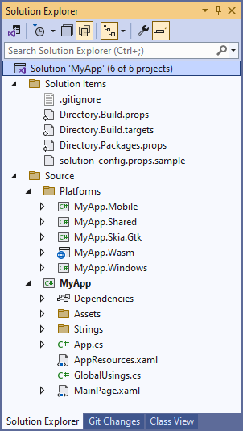

# Solution Structure

This guide briefly explains the structure of an app created with either the [`dotnet new unoapp` template](xref:Uno.GetStarted.dotnet-new) or the [Uno Platform Template Wizard](xref:Uno.GettingStarted.UsingWizard). It's particularly aimed at developers who have not worked with cross-platform codebases before. 

## The project files in an Uno Platform app

After creating a new solution called `MyApp`, it will contain the following projects:

1. A `MyApp.[Platform].csproj` file for each platform that Uno Platform supports: Mobile (iOS/Android/MacCatalyst), Skia.Gtk, Wasm and Windows. These projects are known as **heads** for their respective platform. 

    Head projects typically contain information like settings, metadata, dependencies, and also a list of files included in the project. Each of the head projects has a reference to the main class library of the application.

    The head projects are the projects that generate the executable binaries for the platform. They are also the projects that are used to debug the application on the platform. Right-click on the project in the **Solution Explorer** tool window and select `Set as Startup Project` to debug the application on the platform.

2. A `MyApp.csproj` file. This is the **Application Class Library** for the application and contains most of the code for the application. 
    The **Application Class Library** will contain most of the classes, XAML files, [String resources](features/working-with-strings.md) and assets ([images](features/working-with-assets.md), [fonts](features/custom-fonts.md) etc) for the application.

> [!NOTE]
> The `App.xaml` and `App.xaml.cs` in an Uno Platform solution template are named `AppResources.xaml` and `App.cs`, respectively. Both are automatically included as part of each head's `App.xaml` and `App.xaml.cs` in order to create a cross-platform experience. It is recommended to use `AppResources.xaml` and `App.cs` for editing the application's startup.

## Handling dependencies

Dependencies (ie NuGet Package References) should be added to the  **Application Class Library**. This ensures that the dependencies are available to all the heads of the application. Dependencies that are only required for a specific platform they can be added to the head project for that platform. Alternatively, they can be conditionally included in the **Application Class Library** by setting an appropriate `Condition` on the `PackageReference` element in the project file.

## Further information

See additional guides on handling platform-specific [C# code](platform-specific-csharp.md) and [XAML markup](platform-specific-xaml.md) in an Uno Platform project.

The Uno Platform solution also [can be further optimized](xref:Build.Solution.TargetFramework-override) to build larger projects with Visual Studio 2022.
